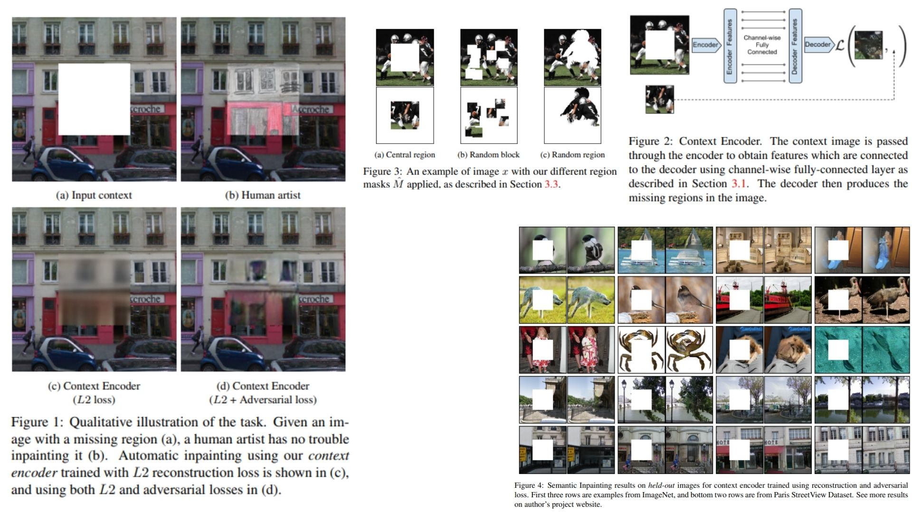

# 🖌️ ContextEncoder-Replication — Context Encoder for Image Inpainting

This repository provides a **faithful Python replication** of the **Context Encoder framework** for **learning visual features via inpainting**.  
The code implements the pipeline described in the original paper, including **center masking, patch extraction, encoder-decoder reconstruction, and adversarial training**.

Paper reference: *[Context Encoders: Feature Learning by Inpainting](https://arxiv.org/abs/1604.07379)*

---

## Overview 🌌



> The pipeline masks the **center region** of an input image, extracts the **ground truth patch**, passes the masked image through an **encoder-decoder generator**,  uses a **discriminator**, and computes **reconstruction and adversarial losses** to train the model.

Key points:

- **Masked input** — center region of image is zeroed out as the context:

```math
x_{\text{context}} = \text{mask\_center}(x)
```

- **Ground truth patch** — the center crop used as reconstruction target:

```math
x_{\text{center}} = \text{extract\_center\_patch}(x)
```

- **Encoder → Decoder** — the masked image is encoded to a latent vector, then decoded to a predicted patch:

```math
z = \text{Encoder}(x_{\text{context}}), \qquad \hat{x}_{\text{center}} = \text{Decoder}(z)
```

- **Reconstruction loss** — pixel-wise L2 between prediction and ground truth:

```math
L_{\text{rec}} = \|\hat{x}_{\text{center}} - x_{\text{center}}\|^2
```

- **Adversarial loss** — standard GAN objective on the center patch:

```math
L_{\text{adv}} = -\Big[\mathbb{E}[\log D(x_{\text{center}})] + \mathbb{E}[\log(1 - D(\hat{x}_{\text{center}}))]\Big]
```

- **Total loss** — weighted combination:

```math
L_{\text{total}} = \lambda_{\text{rec}} \cdot L_{\text{rec}} + \lambda_{\text{adv}} \cdot L_{\text{adv}}
```

---

## Why Context Encoders Matter 🌿

- Learns **visual feature representations** without labels 🖼️  
- Uses **inpainting as self-supervision**, forcing the model to capture context  
- Combines **reconstruction and adversarial objectives** for realistic predictions  
- Works with **any image dataset**, providing a foundation for downstream tasks  

---

## Repository Structure 🏗️

```
ContextEncoder-Replication/
├── src/
│   ├── backbone/
│   │   ├── encoder_conv.py        # Encoder conv blocks
│   │   ├── decoder_deconv.py      # Decoder deconv blocks
│   │   └── discriminator_conv.py  # Discriminator conv blocks
│   │
│   ├── layers/
│   │   ├── masking.py             # mask_center → x_context
│   │   ├── patch_extractor.py     # extract_center_patch → x_center
│   │   └── merging.py             # Optional: merge predicted patch to context
│   │
│   ├── loss/
│   │   └── losses.py              # rec, adv, total loss
│   │
│   ├── model/
│   │   └── context_encoder_pipeline.py  # Encoder + decoder + discriminator + forward
│   │
│   └── config.py
│
├── images/
│   └── figmix.jpg
│
├── requirements.txt
└── README.md
```

---

## 🔗 Feedback

For questions or feedback, contact:  
[barkin.adiguzel@gmail.com](mailto:barkin.adiguzel@gmail.com)
